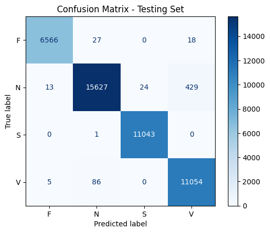
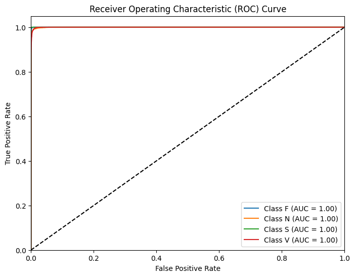

# 🫀 Detection and Classification of Cardiac Arrhythmia from ECG Signals using Deep Neural Networks

## 📌 Overview
This project applies deep learning to classify different types of **cardiac arrhythmias** from ECG signals.  
The model was trained on MIT-BIH ECG Dataset and achieves **97% accuracy**.  

---

## 🚀 Run in Google Colab
You can directly try this project in Colab without installing anything:

---

## 🛠️ Tech Stack
- Python (NumPy, Pandas, Matplotlib, Scikit-learn)
- Deep Learning (TensorFlow / Keras API)
- Jupyter / Google Colab

---

## 📂 Project Files
- `cardiac_arrhythmia.ipynb` → main notebook    
- `requirements.txt` → dependencies  
- `images/` → confusion matrix, plots, outputs  

---

## 📊 Results
- Accuracy: **97%**  
- Confusion Matrix:  
    

- ROC Curve:  
  

---

## 🔮 Future Improvements
- Deploy model with **Flask/Django** for a web app  
- Add **real-time ECG signal processing**  
- Improve accuracy with more data  

---

## 👨‍💻 Author
**Nived**  
📧 [Email](mailto:nivedsree2002@gmail.com)  
🔗 [LinkedIn](https://linkedin.com/in/sreenivedap)
